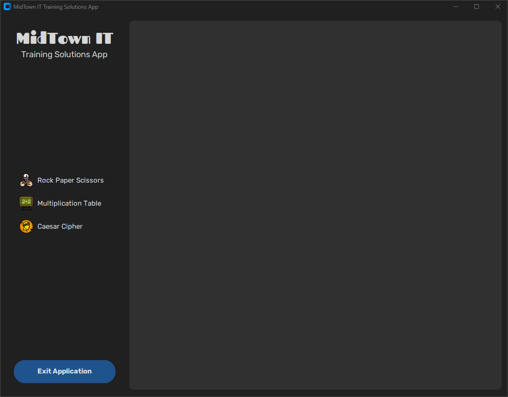
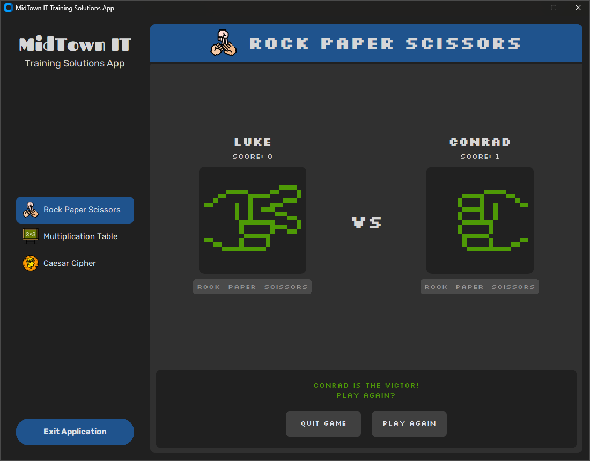
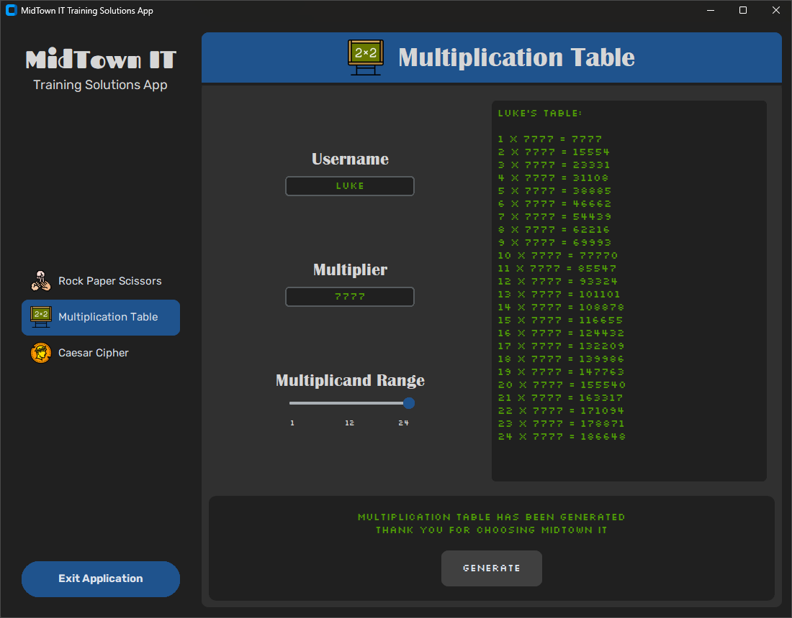
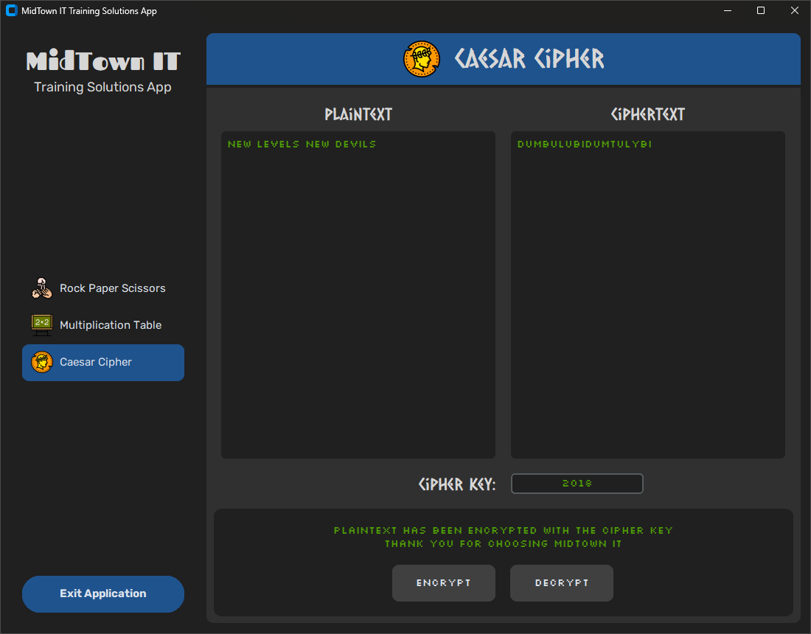

# MidTown IT Training Solutions App

## Description
This project was developed as part of an assignment at TAFE Queensland for subject ICTPRG434-435.

The MidTown IT Training Solutions App provides a GUI hub to switch between three algorithmic solutions:
- Rock Paper Scissors
- Multiplication Table
- Caesar Cipher

<p align="center">
  
</p>

## Table of Contents
- [Installation](#installation)
- [Usage](#usage)
- [License](#license)
- [Acknowledgments](#acknowledgments)
- [Source Code](#source-code)
- [Dependencies](#dependencies)
- [User Manual](#user-manual)

## Installation
To install and run the project from source, follow these steps:

1. Clone the repository:
    ```sh
    git clone https://github.com/LukeWait/gui-app-switcher-midtownapp.git
    cd gui-app-switcher-midtownapp
    ```

2. (Optional) Create and activate a virtual environment:
    ```sh
    python -m venv midtownapp-venv
    source midtownapp-venv/bin/activate  # On Windows, use `midtownapp-venv\\Scripts\\activate`
    ```

3. Install the dependencies:
    ```sh
    pip install -r requirements.txt
    ```

4. Run the application:
    ```sh
    python midtownapp.py
    ```

## Usage
After running the `midtownapp.py` file, you can easily switch between the following applets:
- **Rock Paper Scissors**: Play a classic game against another player.
  
<p align="center">
  
</p>

- **Multiplication Table**: Generate and view multiplication tables.

<p align="center">
  
</p>

- **Caesar Cipher**: Encrypt and decrypt text using the Caesar Cipher algorithm.

<p align="center">
  
</p>

## License
This project is licensed under the MIT License. See the LICENSE file for details.

## Acknowledgments
Icons used in the app are designed by Freepik - [www.freepik.com](https://www.freepik.com).

## Source Code
The source code for this project can be found in the GitHub repository: [https://github.com/LukeWait/gui-app-switcher-midtownapp](https://www.github.com/LukeWait/gui-app-switcher-midtownapp).

## Dependencies
For those building from source, the dependencies listed in `requirements.txt` are:
- CTkToolTip==0.8
- customtkinter==5.2.1
- darkdetect==0.8.0
- packaging==23.2
- Pillow==10.1.0

## User Manual
For detailed instructions on installation, setup, and usage, please refer to the [User Manual](https://github.com/LukeWait/gui-app-switcher-midtownapp/blob/main/docs/midtownapp_user_manual.pdf).
